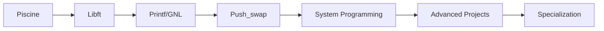

<div align="center">

# 👋 Welcome to My GitHub Profile

### Ahmed AIT ELAAOUD

**Software Engineering Student | 42 Network | Low-Level Programming Enthusiast**

[](https://profile.intra.42.fr/users/ahmedaitelaaoud)
[](https://linkedin.com/in/ahmed-ait-elaaoud)
[](mailto:your.email@example.com)

</div>

---

## 🎯 About Me

I'm a dedicated software engineering student at **1337 (42 Network)** with a passion for understanding systems from the ground up. I don't just use libraries—I rebuild them to truly understand how they work. My focus is on low-level programming, algorithmic problem-solving, and creating robust, efficient software.

```c
while (alive) {
    eat();
    sleep();
    code();
    repeat();
}
```

### 🔭 Current Focus

- 🧠 Mastering algorithmic complexity and optimization strategies
- 🔧 Building projects with C, focusing on memory management and performance
- 🐧 Deepening my understanding of Unix systems and shell scripting
- 📚 Continuously learning best practices in software architecture

### 💡 What I Bring

- **Problem Solver**: Transforming complex challenges into elegant solutions
- **Detail-Oriented**: Writing clean, Norminette-compliant code
- **Systems Thinker**: Understanding software from bare metal to application layer
- **Continuous Learner**: Always exploring new technologies and methodologies

---

## 🛠️ Technical Skills

### Languages & Core Technologies

<div align="center">


</div>

### Tools & Platforms

<div align="center">


</div>

### Development Tools

- **Debugging**: GDB, Valgrind, LLDB
- **Version Control**: Git, GitHub
- **Virtualization**: VirtualBox, Docker
- **Build Systems**: Make, CMake

---

## 📊 GitHub Statistics

<div align="center">


</div>

---

## 🏆 42 Network Projects

<table>
<tr>
<td width="50%">

### 🎯 Core Projects

- **[Libft](https://github.com/ahmedaitelaaoud/libft)** - Complete reimplementation of C standard library functions
- **[Get Next Line](https://github.com/ahmedaitelaaoud/get_next_line)** - Efficient file reading function with buffer management
- **[ft_printf](https://github.com/ahmedaitelaaoud/printf)** - Custom implementation of the printf function
- **[Push_swap](https://github.com/ahmedaitelaaoud/push_swap)** - Sorting algorithm with stack operations

</td>
<td width="50%">

### 🖥️ System & Advanced Projects

- **Born2beroot** - Linux system administration and virtualization
- **Python Module 00** - Introduction to Python programming (In Progress)
- **Pipex** - Unix pipeline implementation
- **Minishell** - Custom shell with process management

</td>
</tr>
</table>

### 📈 Project Highlights

```plaintext
✅ Libft         ━━━━━━━━━━━━━━━━━━━━━━ 100%
✅ Printf        ━━━━━━━━━━━━━━━━━━━━━━ 100%
✅ Get_next_line ━━━━━━━━━━━━━━━━━━━━━━ 125%
✅ Push_swap     ━━━━━━━━━━━━━━━━━━━━━━ 100%
✅ Born2beroot   ━━━━━━━━━━━━━━━━━━━━━━ 110%
🔄 Python Module 00 ━━━━━━━━━━━━━━━━━━ In Progress
```

---

## 🎓 Learning Journey



### Current Learning Path

- ✅ **Foundations**: C programming, Memory management, Data structures
- 🔄 **In Progress**: Algorithmic optimization, System calls, Process management
- 📋 **Next Steps**: Network programming, Graphics, Cybersecurity

---

## 🌟 Achievements

<div align="center">

[](https://github.com/ryo-ma/github-profile-trophy)

</div>

---

## 📫 Let's Connect

I'm always open to discussing new projects, innovative ideas, or opportunities to collaborate!

<div align="center">

[](https://github.com/ahmedaitelaaoud)
[](https://linkedin.com/in/ahmed-ait-elaaoud)
[](mailto:your.email@example.com)
[](https://twitter.com/yourusername)

</div>

---

<div align="center">

### 💭 Philosophy

*"Start where you are. Use what you have. Do what you can."*

**🔥 Turning caffeine into clean code, one commit at a time**


</div>

---

<div align="center">

**⭐ From [ahmedaitelaaoud](https://github.com/ahmedaitelaaoud) | Made with ❤️ and lots of ☕**

</div>
